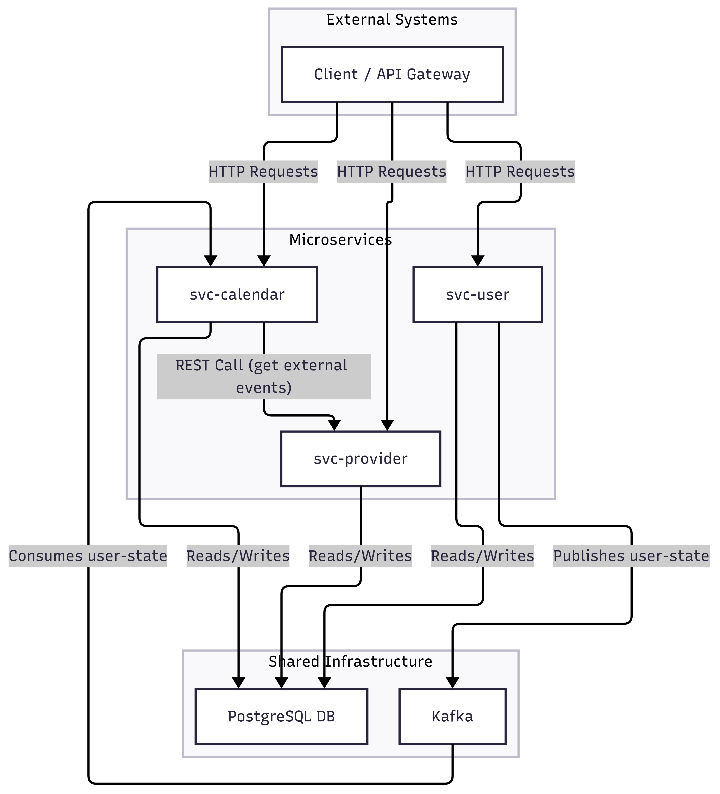

# QA Backend Challenge
**Congratulations!**

Your application for the QA Engineer position piqued our interest. You can test—we trust you on that one.<br>
However, we’d like to see your style!<br>
This multi-maven project contains a set of simplified microservices that work together to manage `users`, `calendars`, and `events`.
The goal of this challenge is to write automated test suites for selected services using:
<br>-`Java`(min. version 17)<br>-`RestAssured`(as an API testing framework)
<br>-`Junit5`(as a test runner)
<br>-`AllureReport`(for reporting)<br>But before that, lets explain a bit the system we want you to test.


## Overall Architecture

The system is composed of three main services: `svc-user`, `svc-calendar`, and `svc-provider`. They communicate with each other via REST APIs and asynchronously through Kafka.



### Services

-   **[svc-user](./svc-user/README.md)**: Manages users and their associated calendars. It publishes user state changes to a Kafka topic called `user-state`
-   **[svc-provider](./svc-provider/README.md)**: Mimics the behavior of an external calendar provider (like Google Calendar, for example). Service `svc-calendar` calls this service to fetch external events.
-   **[svc-calendar](./svc-calendar/README.md)**: Manages meetings and calendar events. It consumes user data from a Kafka topic called `user-state` to stay synchronized and fetches external event data trough API from `svc-provider` to handle event conflicts.

Services are written in `Java 17`, with `SpringBoot 3.1`, using `Postgres` as a database, and `Kafka` as an event-driven asynchronous messaging system.

## Prerequisites

To configure and run the services, you will need:
1. **Docker** - https://docs.docker.com/desktop/
2. **Docker Compose** -https://docs.docker.com/compose/install/
3. **Maven 3** - https://maven.apache.org/install.html
4. **Java 17 SDK** - https://docs.oracle.com/en/java/javase/17/install/overview-jdk-installation.html


## How to Run

1.  **Start Dependencies**:
    Make sure you have Docker and Docker Compose installed, then run:
    ```bash
    docker-compose up -d
    ```
    This command starts the required infrastructure: PostgreSQL, Kafka, Zookeeper, and Schema Registry.<br>
    Make sure all services are running and healthy.<br><br>

2.  **Run the Services**:
    Each service can be run independently using Maven. To run a specific service, navigate to its directory and execute:
    ```bash
    # For example, to run svc-user
    cd svc-user
    mvn spring-boot:run
    ```

## Accessing Tools

-   **Kafka UI**: [http://localhost:8090](http://localhost:8090)
-   **Schema Registry UI**: [http://localhost:8001](http://localhost:8001)
-   **Svc-provider Swagger**:http://localhost:8083/swagger-ui/index.html
-   **Svc-calendar Swagger**:http://localhost:8082/swagger-ui/index.html
-   **Svc-user Swagger**:http://localhost:8080/swagger-ui/index.html
-   **Database (PostgreSQL)**:
    -   **Host**: `localhost`
    -   **Port**: `5432`
    -   **Username**: `postgres`
    -   **Password**: `postgres`
    -   **Databases**: `userdb`, `calendardb`, `providerdb`

## The challenge
The challenge here is to write automated regression tests for services `svc-user` and `svc-calendar`, since in really we don't want 
to test external providers (`svc-provider`), but they often need to be used to set up test data.
<br><br>
Use all available documentation (swagger, service source code, and Readme files) to figure out what are the test scenarios and flows you want to cover.

## How to provide task result
1. Please create a private GitHub repo and push our code as an initial commit.<br>
2. Add the `tests` folder in the `root` path, where you would add your solution.<br>
3. The solution should contain a `Readme` file with instructions on how to execute tests and your conclusion on bugs found or improvement suggestions. We want to see your thought process here while solving this challenge.
4. In the end, send us the link of your repo and share it with account(s) specified in the email by your interviewer.
<br>
<br>
> **To finish the challenge, you can take up to 6 hours in the following 7 days. We trust you on the fair approach.**
 
<br>
<br>
