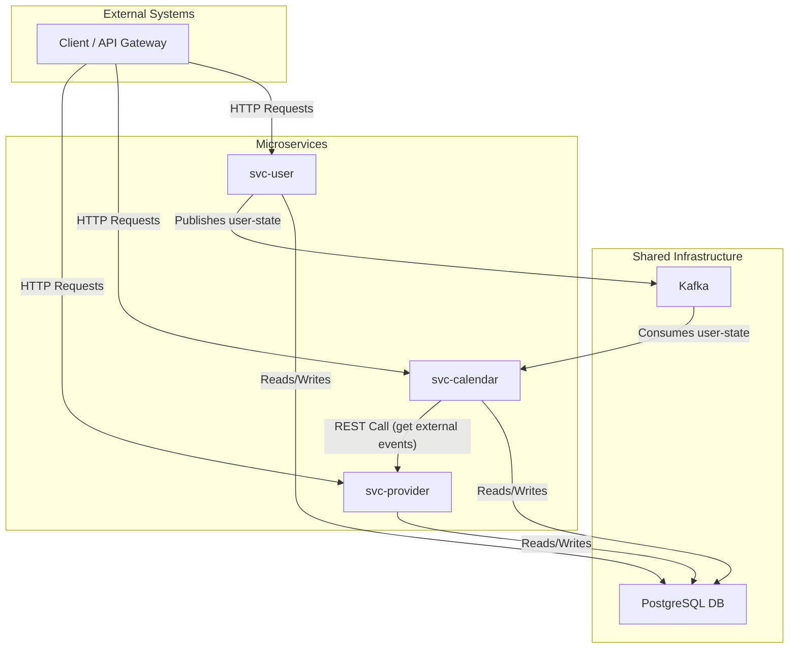

# QA Backend Challenge Services

This project contains a set of microservices that work together to manage users, calendars, and events.

## Overall Architecture

The system is composed of three main services: `svc-user`, `svc-calendar`, and `svc-provider`. They communicate with each other via REST APIs and asynchronously through Kafka.



### Services

-   **[svc-user](./svc-user/README.md)**: Manages users and their associated calendars. It publishes user state changes to a Kafka topic.
-   **[svc-provider](./svc-provider/README.md)**: Manages calendars and events from external providers. This service is consumed by `svc-calendar` to fetch external events.
-   **[svc-calendar](./svc-calendar/README.md)**: Manages meetings and calendar events. It consumes user data from Kafka to stay synchronized and fetches external event data from `svc-provider` to handle conflicts.

## How to Run

1.  **Start Dependencies**:
    Make sure you have Docker and Docker Compose installed, then run:
    ```bash
    docker-compose up -d
    ```
    This command starts the required infrastructure: PostgreSQL, Kafka, Zookeeper, and Schema Registry.

2.  **Run the Services**:
    Each service can be run independently using Maven. To run a specific service, navigate to its directory and execute:
    ```bash
    # For example, to run svc-user
    cd svc-user
    mvn spring-boot:run
    ```

## Testing

To run the tests for all services, you can run the following command from the root directory:
```bash
mvn clean test
```

## Accessing Admin Tools

-   **Kafka UI**: [http://localhost:8090](http://localhost:8090)
-   **Schema Registry UI**: [http://localhost:8001](http://localhost:8001)
-   **Database (PostgreSQL)**:
    -   **Host**: `localhost`
    -   **Port**: `5432`
    -   **Username**: `postgres`
    -   **Password**: `postgres`
    -   **Databases**: `userdb`, `calendardb`, `providerdb`

